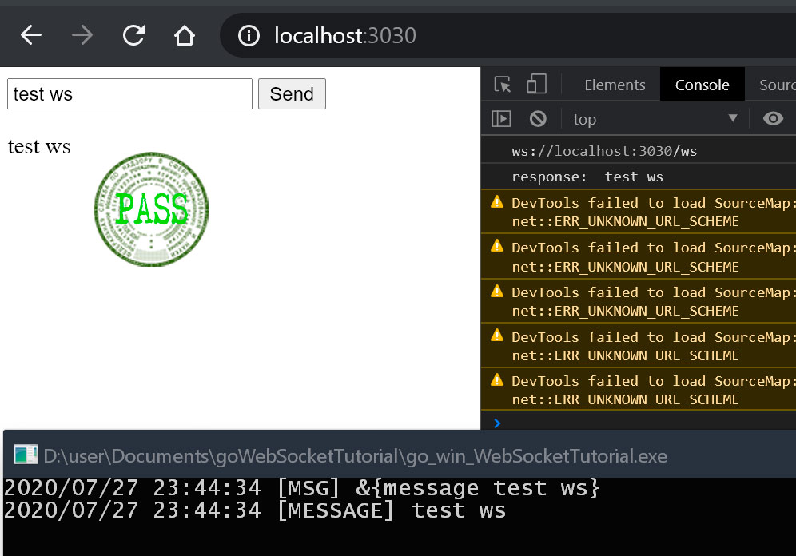

# Test WebSocket
### Тестирование ВэбСокетов для http соединения. 

#### Запуск программы

* ```go_win_WebSocketTutorial.exe``` для windows
* ```./go_lin_WebSocketTutorial``` для Linux
* Для других ОС см. ```go build```


#### Использование
* Для теста можно зайти на адрес встроенного сервера
[localhost:3030](http://localhost:3030)
* Вести любые данные
* Они должны свободно вводиться в систему

#### Скриншоты
Пример окна с успешно рабочими WebSocket-ами

